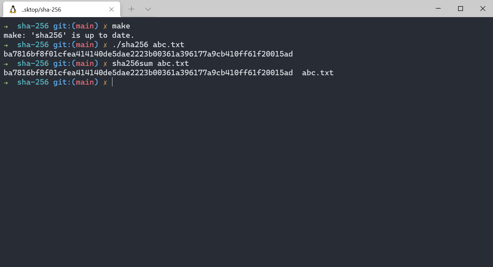

<h2 align="center">
    SHA-256 Calculator
</h3>

<h3 align="center">
    A program written in C that calculates the SHA-256 of an input file
</h4>

## Command Line Installations
<b>In windows terminal:</b> <br>
Install make and gcc: ``` sudo apt install build-essential```<br>
ZSH shell: ``` sudo apt install zsh``` <br>
Nicer ZSH shell (optional): ``` sh -c "$(curl -fsSL https://raw.github.com/ohmyzsh/ohmyzsh/master/tools/install.sh)" ```

## Running the Program
- In your command line terminal: ```git clone https://github.com/GraceKeane/sha-256.git```<br>
- Navigate to the <b> \program\ </b> directory: ```cd sha-256```<br>
- Compile the program: ```make```<br>
- Execute options program: ```./sha256 abc.txt``` <br>
- Run tests: ```make test``` <br>

## Program Output
<p align="center">
  
</p>


